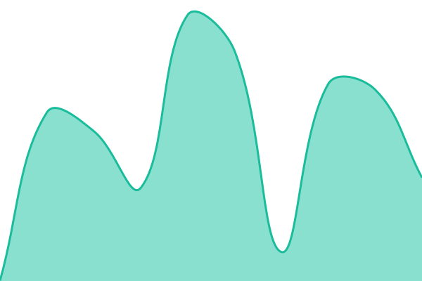
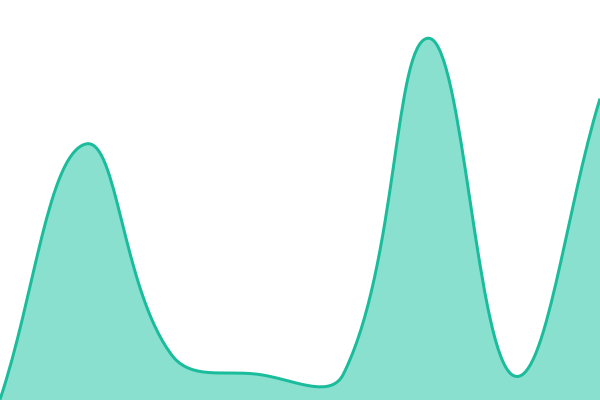
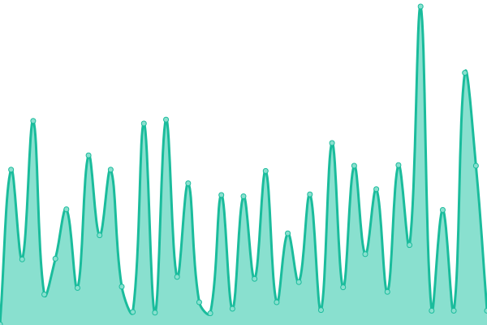
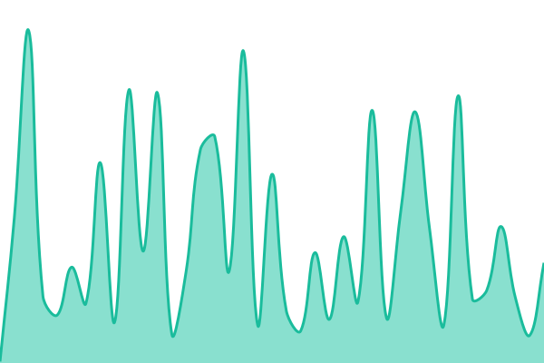

# [📈 Live Status](https://ferdysopian.github.io/jegmontol): <!--live status--> **🟧 Partial outage**

This repository contains the open-source uptime monitor and status page for [ferdysopian](https://ferdysopian.github.io/jegmontol), powered by [Upptime](https://github.com/upptime/upptime).

With [Upptime](https://upptime.js.org), you can get your own unlimited and free uptime monitor and status page, powered entirely by a GitHub repository. We use [Issues](https://github.com/ferdysopian/jegmontol/issues) as incident reports, [Actions](https://github.com/ferdysopian/jegmontol/actions) as uptime monitors, and [Pages](https://ferdysopian.github.io/jegmontol) for the status page.

<!--start: status pages-->
<!-- This summary is generated by Upptime (https://github.com/upptime/upptime) -->
<!-- Do not edit this manually, your changes will be overwritten -->
<!-- prettier-ignore -->
| URL | Status | History | Response Time | Uptime |
| --- | ------ | ------- | ------------- | ------ |
|  [Support](https://support.jegtheme.com/) | 🟩 Up | [support.yml](https://github.com/ferdysopian/jegmontol/commits/HEAD/history/support.yml) | 

 438ms
     
 | 

<a href="https://ferdysopian.github.io/jegmontol/history/support">100.00%</a>
    

|  [Templatekit](https://templatekit.jegtheme.com/) | 🟩 Up | [templatekit.yml](https://github.com/ferdysopian/jegmontol/commits/HEAD/history/templatekit.yml) | 

 467ms
     
 | 

<a href="https://ferdysopian.github.io/jegmontol/history/templatekit">100.00%</a>
    

|  [JNews](https://jnews.io/default/) | 🟩 Up | [j-news.yml](https://github.com/ferdysopian/jegmontol/commits/HEAD/history/j-news.yml) | 

 114ms
     
 | 

<a href="https://ferdysopian.github.io/jegmontol/history/j-news">100.00%</a>
    

|  [JNews TF](https://themeforest.net/item/jnews-one-stop-solution-for-web-publishing/20566392) | 🟥 Down | [j-news-tf.yml](https://github.com/ferdysopian/jegmontol/commits/HEAD/history/j-news-tf.yml) | 

 150ms
     
 | 

<a href="https://ferdysopian.github.io/jegmontol/history/j-news-tf">17.95%</a>
    

|  [JNews TF Preview](https://preview.themeforest.net/item/jnews-one-stop-solution-for-web-publishing/full_screen_preview/20566392) | 🟥 Down | [j-news-tf-preview.yml](https://github.com/ferdysopian/jegmontol/commits/HEAD/history/j-news-tf-preview.yml) | 

 88ms
     
 | 

<a href="https://ferdysopian.github.io/jegmontol/history/j-news-tf-preview">16.74%</a>
    

<!--end: status pages-->

[**Visit our status website →**](https://ferdysopian.github.io/jegmontol)

## 📄 License

- Powered by: [Upptime](https://github.com/upptime/upptime)
- Code: [MIT](./LICENSE) © [ferdysopian](https://ferdysopian.github.io/jegmontol)
- Data in the `./history` directory: [Open Database License](https://opendatacommons.org/licenses/odbl/1-0/)
